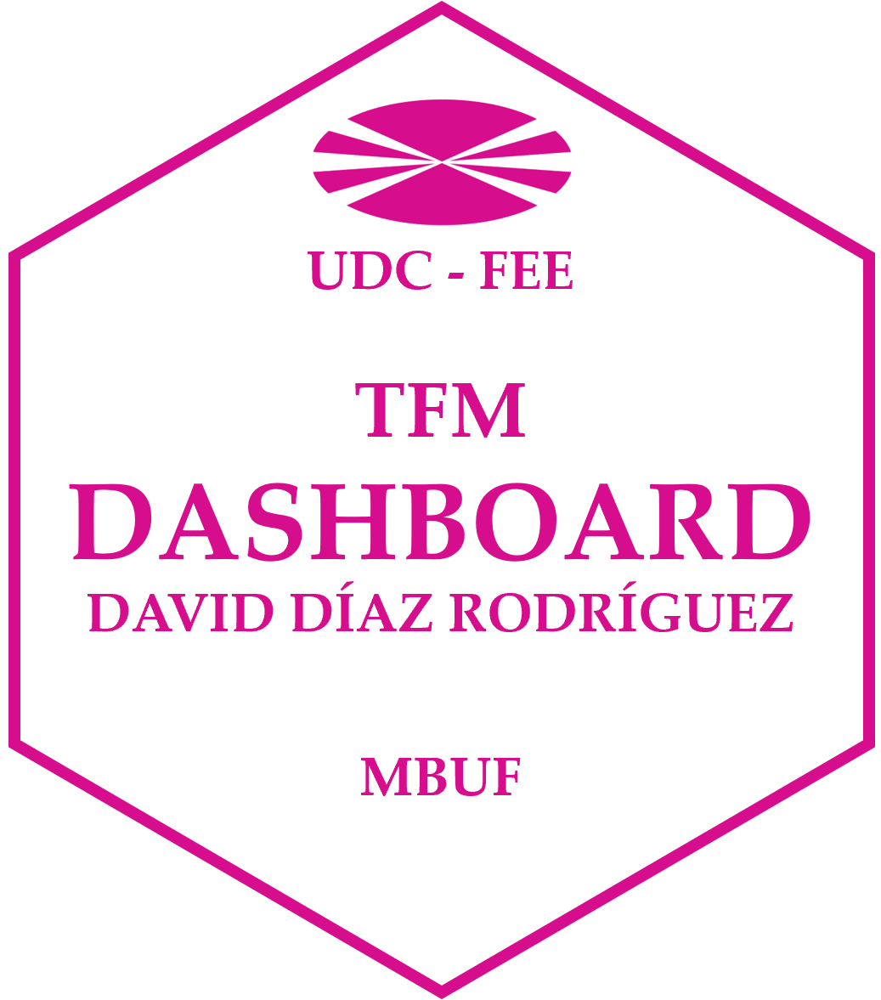

# Español

## Aplicación de redes neuronales artificiales y programación cuadrática en la gestión de carteras

 Este repositorio contiene el código fuente del dashboard construido para el análisis de los resultados obtenidos en el Trabajo de Fin de Máster **"Aplicación de redes neuronales artificiales y programación cuadrática en la gestión de carteras"** de David Díaz Rodríguez y tutelado por Xosé Manuel Martínez Filgueira. El sitio está construido usando [Quarto](https://quarto.org/).

# English

## Application of artificial neural networks and quadratic programming in portfolio management

This repository contains the source code of the dashboard built for the analysis of the results obtained in the Master's Thesis **"Application of artificial neural networks and quadratic programming in portfolio management"** by David Díaz Rodríguez and supervised by Xosé Manuel Martínez Filgueira. The site is built using [Quarto](https://quarto.org/).

# Galego

## Aplicación das redes neuronais artificiais e da programación cuadrática na xestión de carteiras

Este repositorio contén o código fonte do cadro de mando construído para a análise dos resultados obtidos no Traballo de Fin de Máster **"Aplicación das redes neuronais artificiais e da programación cuadrática na xestión de carteiras"** de David Díaz Rodríguez e dirixida por Xosé Manuel Martínez Filgueira. O sitio está construído usando [Quarto](https://quarto.org/).

